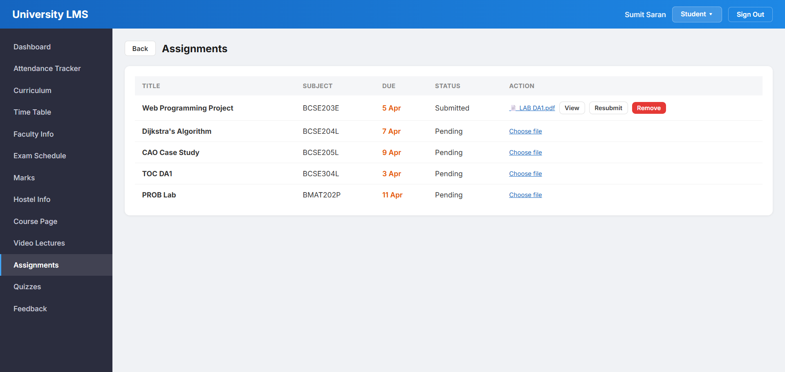
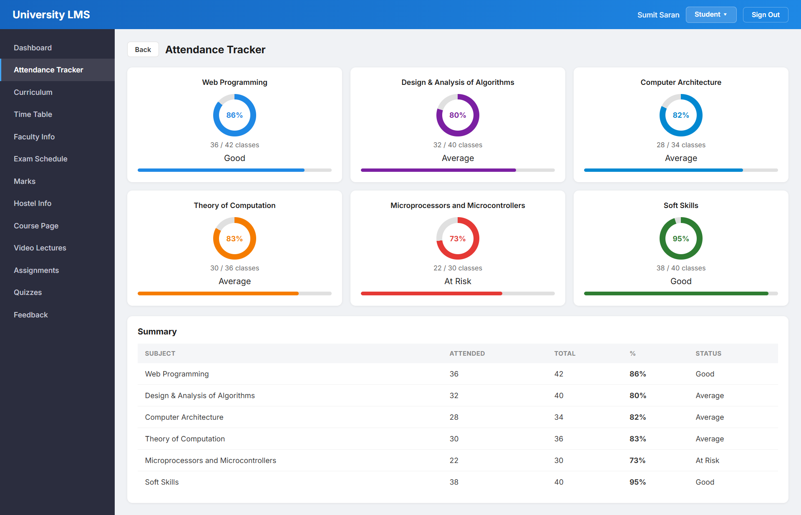
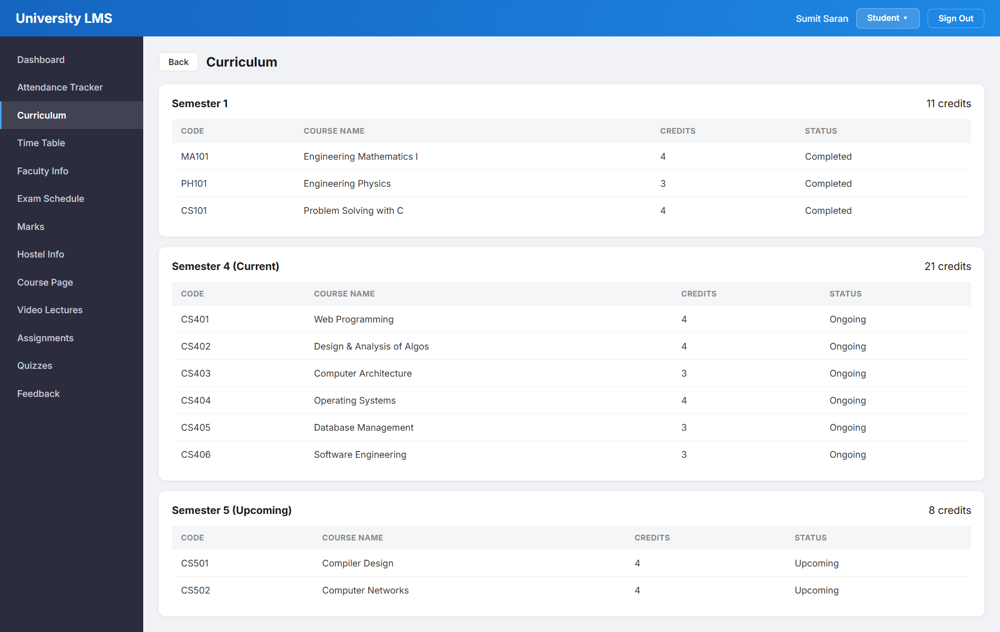
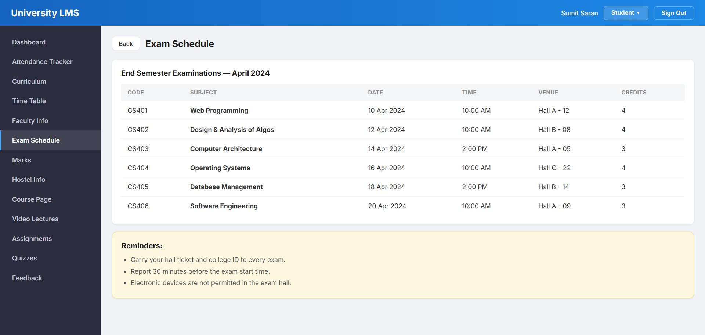
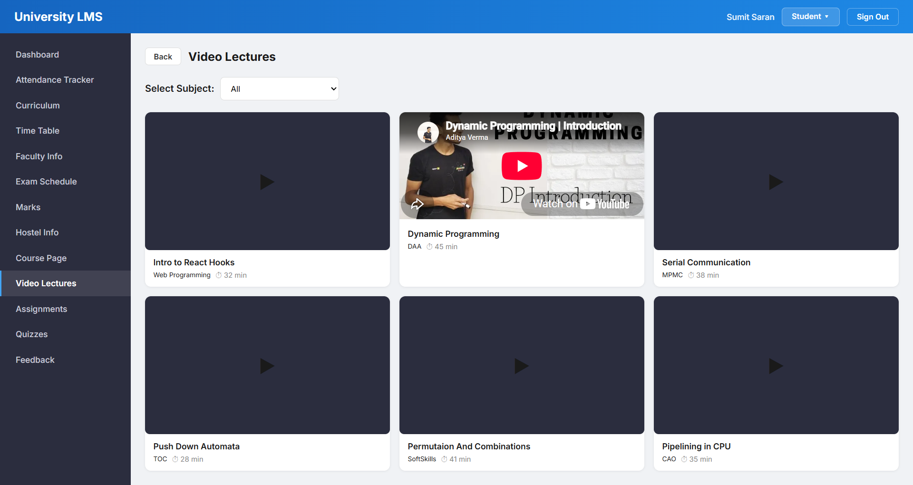
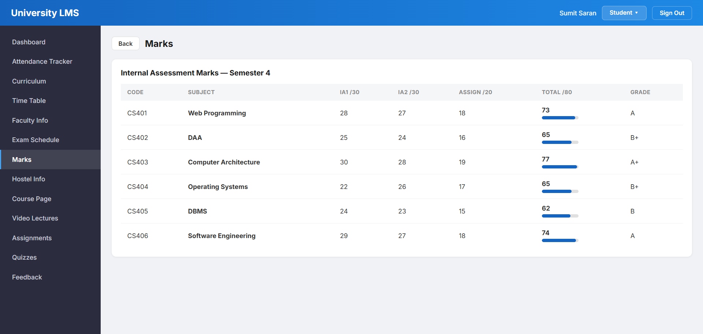
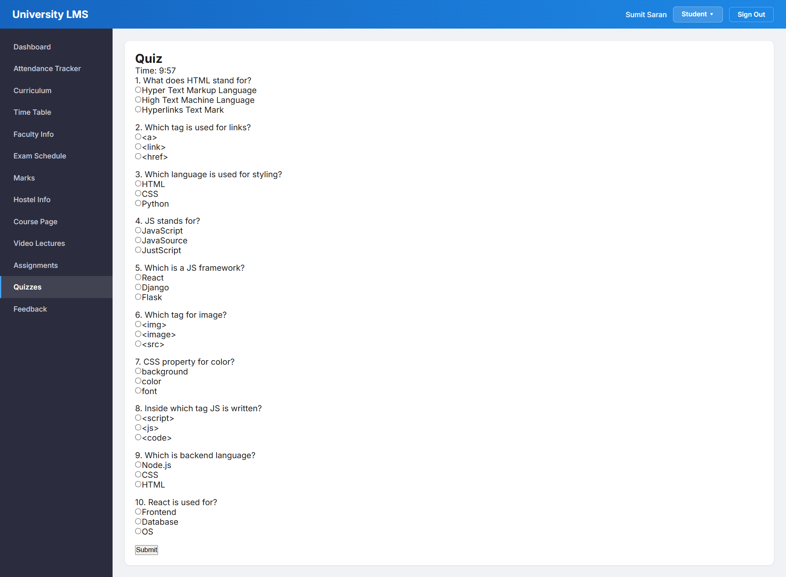
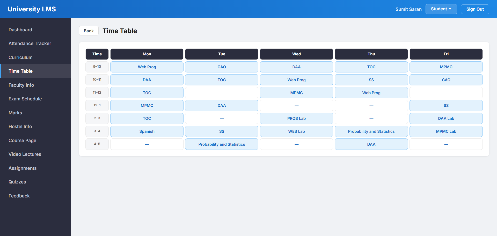

# Student Learning Management System

A responsive Learning Management System (LMS) built using React.js to simplify academic management through an intuitive and modern user interface.

## Features

- Student Dashboard
- Attendance Management
- Curriculum
- Faculty Information
- Timetable
- Assignments
- Quiz Module
- Marks Management
- Examination Details

## Tech Stack

- React.js
- JavaScript
- HTML5
- CSS3

---

## Project Screenshots

### Assignments

---

### Attendance

---

### Curriculum

---

### Examination

---

### Faculty / Lectures

---

### Marks

---

### Quiz Module

---

### Timetable

---

## Future Enhancements

- User Authentication
- Backend Integration
- Database Connectivity
- Admin Dashboard
- Student & Faculty Login
- Notifications System

## Author

**Sumit Saran**
